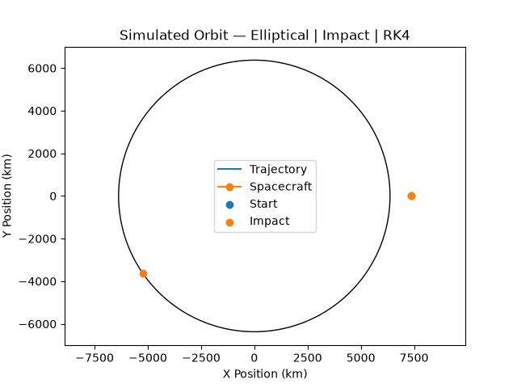

# Orbital Simulator

A two-dimensional orbital mechanics simulator written in C++ that models
spacecraft trajectories around Earth using Newtonian gravity.

The simulator supports configurable launch conditions, automatic trajectory
classification, multiple numerical integration methods, collision and escape
detection, multi-orbit propagation, and Python-based trajectory visualization.

## Example Simulation

<p align="center">
  
</p>

<p align="center">
  <em>
    Example elliptical Earth orbit generated using the C++ simulation engine
    and visualized with Python and Matplotlib.
  </em>
</p>

The visualization is generated from spacecraft state data calculated by the
C++ simulation engine. Python is used only to visualize the resulting trajectory
and simulation metadata.

Depending on the simulation result, the visualization can display:

- Initial and final spacecraft positions
- Earth impact location
- Escape-limit position
- Periapsis and apoapsis for completed bound trajectories
- Trajectory classification
- Numerical integration method

## Features

- Configurable starting altitude
- Configurable launch velocity multiplier and launch angle
- Circular, elliptical, parabolic, and hyperbolic trajectory classification
- Earth-impact detection
- Escape trajectory simulation
- Multi-orbit propagation
- Calculation of:
  - Specific orbital energy
  - Specific angular momentum
  - Eccentricity and eccentricity vector
  - Semi-major axis
  - Periapsis and apoapsis
  - Orbital period
- Three numerical integration methods:
  - Symplectic Euler
  - Velocity Verlet
  - Fourth-order Runge-Kutta (RK4)
- Numerical energy-conservation analysis
- CSV trajectory and simulation metadata output
- Python/Matplotlib trajectory visualization

## Getting Started

### Prerequisites

The project is currently developed and tested on Ubuntu using WSL 2.

The following are required:

- `g++`
- Python 3
- Python `venv`
- `pip`

The visualization additionally uses:

- pandas
- Matplotlib

### Clone the Repository

```bash
git clone https://github.com/alexmcr1s/orbital-simulator.git
cd orbital-simulator
```

### Compile

From the project root:

```bash
g++ src/main.cpp src/orbital-mechanics.cpp -Iinclude -o orbital-simulator
```

### Run

```bash
./orbital-simulator
```

The simulator will prompt for:

1. Initial altitude in kilometers
2. Velocity multiplier
3. Launch angle in degrees
4. Numerical integration method
5. Number of orbits to simulate

## Python Environment Setup

The Python visualization dependencies should be installed inside a virtual
environment.

### Create the Virtual Environment

This only needs to be done once after cloning the repository:

```bash
python3 -m venv .venv
```

### Activate the Virtual Environment

```bash
source .venv/bin/activate
```

After activation, the terminal prompt should begin with:

```text
(.venv)
```

### Install Visualization Dependencies

```bash
pip install -r requirements.txt
```

### Verify the Environment

```bash
python -c "import pandas; import matplotlib; print('ready')"
```

If the environment is configured correctly, the command should output:

```text
ready
```

## Generate a Visualization

First, run the C++ simulator to generate the trajectory and simulation
metadata.

Then, with the Python virtual environment activated, run:

```bash
python plot_orbit.py
```

The resulting visualization is saved as:

```text
"docs/images/orbit-example.gif"
```

`orbit-example.gif` represents the most recently visualized simulation.

## Simulation Output

The simulator generates:

```text
orbit.csv
simulation_metadata.csv
```

## Numerical Methods

The simulator numerically solves the spacecraft equations of motion rather than
using a precomputed Keplerian orbit.

At each timestep, gravitational acceleration is calculated from the spacecraft's
current position:

$$
\mathbf{a} = -\frac{\mu}{r^3}\mathbf{r}
$$

where:

- **𝐫** is the spacecraft position vector relative to Earth's center
- `r` is the magnitude of the position vector
- `μ` is Earth's standard gravitational parameter

Because acceleration continuously changes as the spacecraft moves, the
spacecraft state must be propagated numerically through time.

The simulator currently provides three integration methods.

### Symplectic Euler

The Symplectic Euler method updates velocity using the current gravitational
acceleration and then updates position using the new velocity.

It provides a useful baseline for comparing the behavior of higher-order integration methods.

### Velocity Verlet

Velocity Verlet incorporates acceleration at both the beginning and end of the
timestep.

For orbital systems, this method is particularly useful because of its
long-term behavior in conservative mechanical systems. It provides significantly better orbital stability than the Euler implementation.

### Fourth-Order Runge-Kutta (RK4)

RK4 evaluates the rate of change of the spacecraft state four times during each timestep.

The four derivative estimates sample the beginning, intermediate predicted
states, and predicted end of the timestep. They are combined using the weighted average:

$$
\frac{k_1 + 2k_2 + 2k_3 + k_4}{6}
$$

This produces substantially greater short-term trajectory accuracy than the
lower-order methods for the same timestep size.

## Numerical Accuracy

To compare the numerical integrators, the same near-circular initial condition
was propagated for 100 orbital periods using each method.

### Test Conditions

| Parameter | Value |
| --- | ---: |
| Initial altitude | 400 km |
| Velocity multiplier | 1.001 |
| Launch angle | 91° |
| Simulated orbits | 100 |

All three tests used identical initial conditions and timestep settings. Only
the numerical integration method was changed.

### Results

| Integrator | Energy Error (J/kg) | Relative Energy Error | Final Position Error |
| --- | ---: | ---: | ---: |
| Symplectic Euler | -6.758 × 10⁻³ | 2.301 × 10⁻¹⁰ | 12,747.211 m |
| Velocity Verlet | 2.198 × 10⁻⁶ | 7.482 × 10⁻¹⁴ | 17.757 m |
| RK4 | 5.540 × 10⁻⁶ | 1.886 × 10⁻¹³ | 0.442 m |

For this test, Velocity Verlet produced the smallest final energy error, while
RK4 produced the smallest final position error.

The comparison demonstrates that energy conservation and trajectory
accuracy are separate numerical properties. An integrator can preserve orbital
energy extremely well while still accumulating phase error over many
revolutions.

Symplectic Euler remained stable but accumulated substantially more trajectory
and energy error than either Velocity Verlet or RK4 over the 100-orbit
simulation.

### `orbit.csv`

Contains the propagated spacecraft state throughout the simulation, including:

- Simulation time
- X position
- Y position
- Altitude

### `simulation_metadata.csv`

Contains information describing the simulation, including:

- Trajectory type
- Simulation result
- Numerical integrator
- Periapsis altitude
- Apoapsis altitude
- Periapsis direction

The Python visualization reads these files to construct a representation of
the simulated trajectory.
